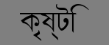
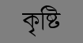

# pygame_raqm_support

Pygame patched with libraqm for rendering unicode complex indic scripts with ligatures.


 {:height="55px" width="130px"}

 {:height="55px" width="130px"}

 {:height="55px" width="130px"}

### Requirements

* [libraqm](https://github.com/HOST-Oman/libraqm)
* python 3.8

### Installation

```
$ sudo apt-get install python3-dev python3-numpy libsdl-dev libsdl-image1.2-dev  libsdl-mixer1.2-dev libsdl-ttf2.0-dev libsmpeg-dev libportmidi-dev libavformat-dev libswscale-dev libjpeg-dev libfreetype6-dev libsdl-ttf2.0-0
```

```
$ git clone https://github.com/dipch/pygame_raqm_support.git
$ cd pygame_raqm_support
$ python3 setup.py
```
